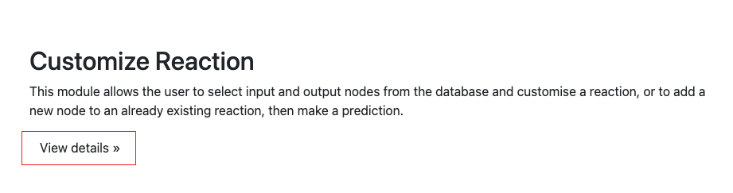

# BPP
BPP: A Platform for Automatic Biochemical Pathway Prediction
> Authors: Xinhao Yi, Siwei Liu, Yu Wu, Douglas McCloskey*, Zaiqiao Meng*

## Contributions
1. We develop BPP, an open-source biochemical pathway analysis platform dedicated to predicting potential links and node attributes in biochemical pathway networks.

2.  Based on BPP, we evaluate the performance of four representation learning models on four biochemical pathway datasets. Experimental results suggest that these automated prediction models can achieve reliable performance on link prediction and attribute prediction task.

3. BPP integrates an explainer that provides an interpretation of the prediction results, i.g., offering the contribution of nodes and attributes within the reaction for current prediction result.

4. We verify the effectiveness of BPP by conducting a case study on SARS-CoV-2's invasion process. The results indicate that BPP can successfully identify unseen links within pathways.

## Experiments
Run the following scripts to execute different experiments:  

#### GNN Attribute Prediction  
Predict missing attributes of biochemical entities using Graph Neural Networks.  
```bash
bash gnn_attribute_prediction_baseline_sweep.sh
```

#### GNN Link Prediction  
Identify missing biochemical interactions using Graph Neural Networks.  

```bash
bash gnn_link_prediction_baseline_sweep.sh
```

#### MF Attribute Prediction
Use Matrix Factorization to infer missing biochemical entity attributes.

```bash
bash mf_attribute_prediction_baseline_sweep.sh
```


### MF Link Prediction
Apply Matrix Factorization to predict unseen biochemical reactions.

```bash
bash mf_link_prediction_baseline_sweep.sh
```


## Motivation

1. Identifying potential links in biochemical pathway networks is essential for targeting disease markers, discovering drug targets, reconfiguring metabolic networks and addressing gaps in pathways holes in biosynthesis.

2. Traditional experimental methods can impose significant time and labour burdens on researchers, due to a vast number of candidates, consequently, our goal is to enhance the efficiency of pathway studies.

## Website
[Link to BPP Platform](http://44.223.34.155:8000/)

## User Guidance
In this part, we'll introduce how to use our plaform. 

### Customise Biochemical Reaction
The key feature in BPP is to customise a biochemical reaction.



Then, you freely select the dataset, customise biochemical reaction and then make prediction. 


Currently, you can choose which of the four datasets - Disease, Metabolism, immune system and signal transduction - you want to study, and then, feel free to select and load the biochemical reactions in that dataset. the biochemical reaction will be presented as a dynamic graph where blue nodes represent input entities, red nodes represent output entities and yellow triangles represent that biochemical reaction itself.


Or you can choose not to load an existing biochemical reaction and instead just create a new blank biochemical reaction by clicking New Reaction. Next, you have the option to freely add biochemical entities. You can select the ones you are interested in from the thousands of biochemical entities in this dataset and add them as inputs or inputs to the current biochemical reaction. This process allows you to narrow down the biochemical entities using the search box we provide.


### How to Cite
If you use BPP in your research, please cite the following paper:

```bash
@article{yi2024bpp,
  title={BPP: a platform for automatic biochemical pathway prediction},
  author={Yi, Xinhao and Liu, Siwei and Wu, Yu and McCloskey, Douglas and Meng, Zaiqiao},
  journal={Briefings in Bioinformatics},
  volume={25},
  number={5},
  pages={bbae355},
  year={2024},
  publisher={Oxford University Press}
}
```


